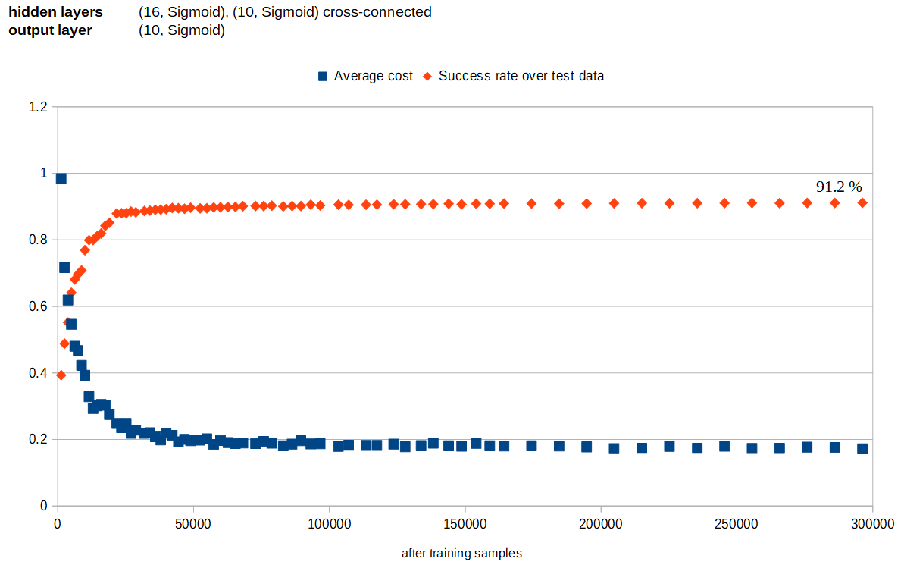
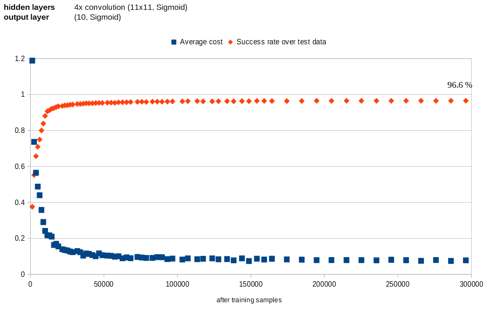
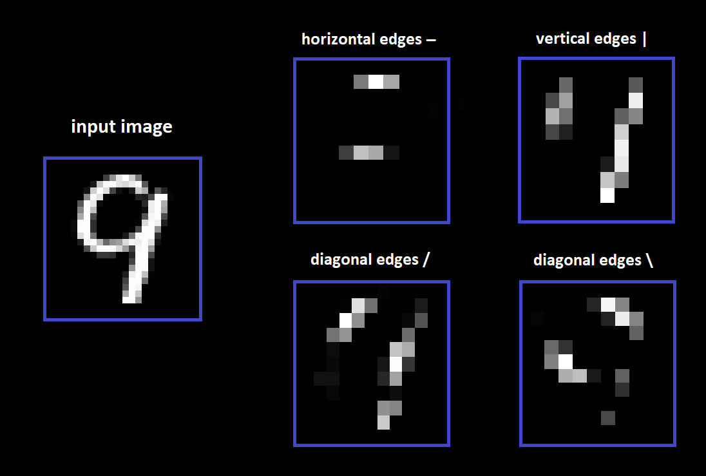

# Neural network from scratch

This is an attempt to build a simple image recognition neural network from scratch with kotlin.
The network is modelled mostly in an object-oriented fashion and without matrix calculations.
The point is to try to understand its inner workings in a more concrete fashion.
This is NOT an attempt to create a well performing and effective solution.

## Online demo

Please also have a look at the React application which uses the network trained by this project.

Demo hosted at: https://neural-network.joosa.net/

Source code: https://github.com/Joosakur/neural-network-demo

## Training and test data

By default, the data used for training and testing is a set of grayscale images of handwritten digits 
with a 28x28 px resolution. 

## Requirements
- Kotlin
- Download the four data files from http://yann.lecun.com/exdb/mnist/ and extract to project root.

## Running
Run main.kt

## Example results

### Attempt 1
Network without any hidden layers works surprisingly well.

### Attempt 2
Network with two hidden layers of 16 nodes with ReLU activation seems to give poor results. 

### Attempt 3
Network with two hidden layers of 16 nodes with Sigmoid activation, and all layers connected to every other layer seems to give rather good results.

### Attempt 4
Network with convolution layers for edge detection gives clearly the best results.

These debug graphics demonstrate how it discovers edges in four directions.

## About Me
Developed by Joosa Kurvinen

https://www.linkedin.com/in/joosa-kurvinen/
