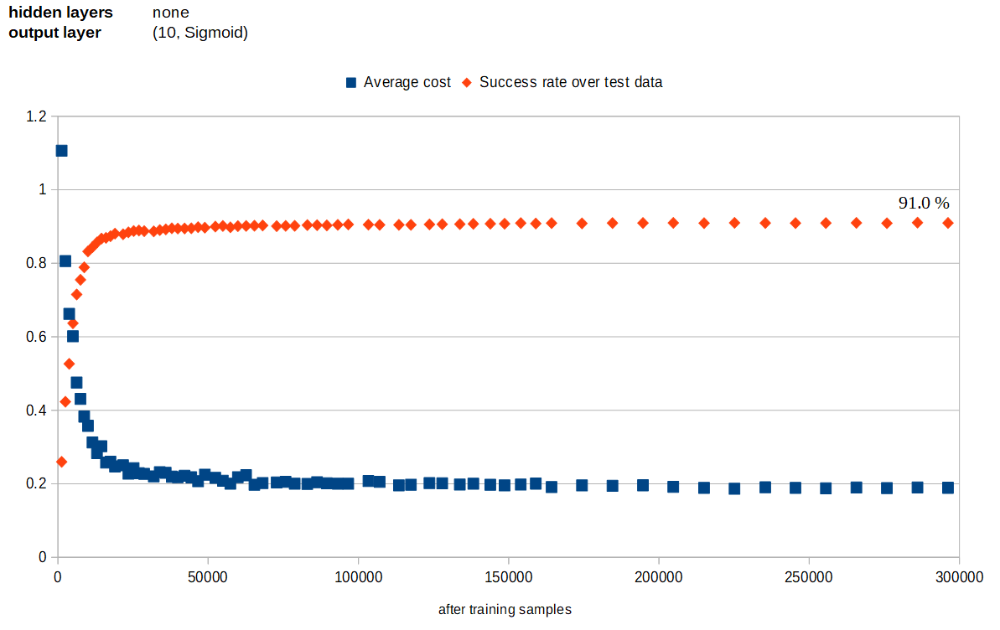

# Neural network from scratch

This is an attempt to build a simple image recognition neural network from scratch with kotlin.
The network is modelled mostly in an object-oriented fashion and without matrix calculations.
The point is to try to understand its inner workings in a more concrete fashion.
This is NOT an attempt to create a well performing and effective solution.

## Training and test data

By default, the data used for training and testing is a set of grayscale images of handwritten digits 
with a 28x28 px resolution. 

## Requirements
- Kotlin
- Download the four data files from http://yann.lecun.com/exdb/mnist/ and extract to project root.

## Edit parameters
You may change e.g. network topology and step size by editing parameters.kt

## Running
Run main.kt

## Example results

### Attempt 1
Network without any hidden layers works surprisingly well.

### Attempt 2
Network with one hidden layer of 32 nodes takes a much longer time to train and gives poor results

### Attempt 3
After some trial and error with network topology, step size and batch size I was able to get close to 90% accuracy, but
that proved to be a glass ceiling.

### Attempt 4
Finally, I added some adhoc convolution layers for edge detection and reached the final result of 96,6 %.

These ascii debug graphics demonstrate how it discovers edges in four directions.

